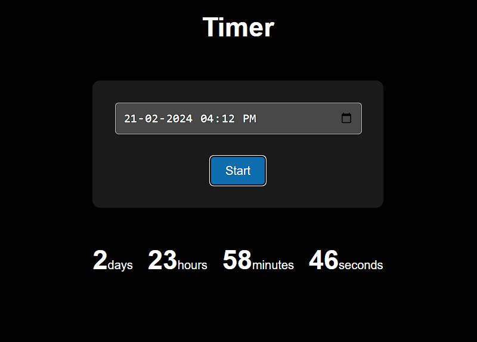

```markdown
# Countdown Timer App

A simple countdown timer application built with React.

## Features

- Set a target date and time.
- Start the countdown timer.
- Displays remaining days, hours, minutes, and seconds.

## Technologies Used

- React
- HTML
- CSS

## Usage

1. Clone the repository:

```bash
git clone https://github.com/Harshitshukla0208/Timer-react
```

2. Navigate to the project directory:

```bash
cd Timer-react
```

3. Install dependencies:

```bash
npm install
```

4. Start the development server:

```bash
npm run dev
```

5. Open your web browser and visit `http://localhost:3000` to view the application.

## Screenshots



## Contributing

Contributions are welcome! Please feel free to fork this repository and submit pull requests to contribute.

## License

This project is licensed under the MIT License - see the [LICENSE](LICENSE) file for details.
```

Feel free to customize this template with additional information about your project, such as how to deploy it, additional features, or any other relevant details.